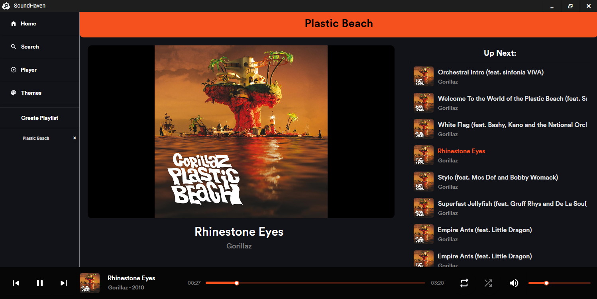
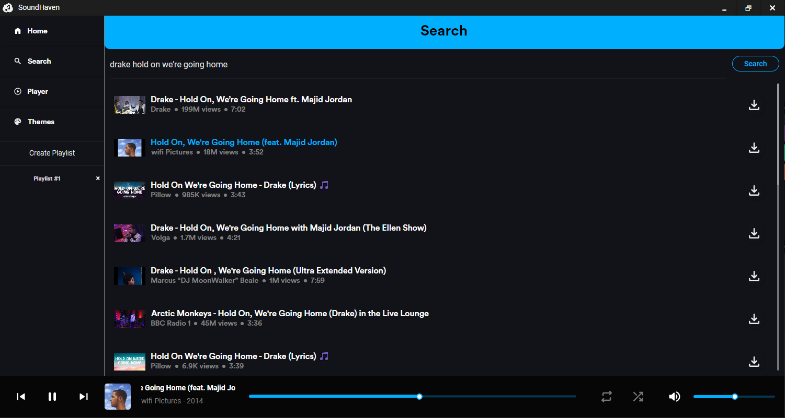

# SoundHaven

SoundHaven is a Windows music player for local audio and YouTube audio
streaming. It supports playlists, seeking, native M4A/AAC downloads, themes,
and optional Last.fm recommendations and scrobbling.

> SoundHaven is preview software. The current release target is 64-bit
> Windows 10 and Windows 11.

## Install

### Portable ZIP

1. Download `SoundHaven-<version>-win-x64.zip` and its `.sha256` file from
   [GitHub Releases](https://github.com/XavierRHMN/SoundHaven/releases).
2. Verify the download:

   ```powershell
   Get-FileHash .\SoundHaven-<version>-win-x64.zip -Algorithm SHA256
   Get-Content .\SoundHaven-<version>-win-x64.zip.sha256
   ```

3. Extract the ZIP and run `SoundHaven\SoundHavenClient.exe`.

The package is self-contained; users do not need to install .NET.

### User-scope installer

The optional installer downloads a prebuilt GitHub Release, verifies its
SHA-256 checksum, and installs it without administrator access under
`%LocalAppData%\Programs\SoundHaven`.

```powershell
Invoke-WebRequest `
  https://raw.githubusercontent.com/XavierRHMN/SoundHaven/master/SoundHaven_Install.ps1 `
  -OutFile .\SoundHaven_Install.ps1

# Review the script, then run it:
powershell -NoProfile -ExecutionPolicy Bypass -File .\SoundHaven_Install.ps1
```

Pass `-Version 0.1.0` to install a specific release. Safe reruns perform an
atomic upgrade and restore the prior installation if the upgrade fails.

Run `SoundHaven_Uninstall.ps1` from the installation directory or use the
Start Menu shortcut to uninstall. User data is preserved by default. Use
`-PurgeUserData` only when you intentionally want to delete it.

### Windows SmartScreen

Preview builds are currently unsigned. Windows may display a SmartScreen
warning. Verify the release checksum and confirm that the download came from
this repository before choosing **More info → Run anyway**.

## Features

- Local audio playback with playlists, metadata, repeat, shuffle, and seeking
- YouTube search and AAC/M4A streaming through YoutubeExplode
- Reliable repeated YouTube seeks with stream refresh and a local-cache fallback
- Native M4A downloads with no FFmpeg dependency or lossy re-encoding
- Persistent SQLite data under `%LocalAppData%\SoundHaven`
- Optional Last.fm recommendations, recent tracks, and scrobbling
- Custom and artwork-derived themes

Use YouTube functionality only for media you are permitted to access or save,
and follow YouTube's terms and applicable law.

## Optional Last.fm setup

SoundHaven works without Last.fm. To enable it, create a Last.fm API
application and set these user environment variables:

```powershell
setx LASTFM_API_KEY "your-api-key"
setx LASTFM_API_SECRET "your-api-secret"
```

Restart SoundHaven after setting them. Account passwords are entered through a
masked control and are not stored by SoundHaven. API credentials are not part
of installation and should never be committed to the repository.

## Data locations

- Application files: portable extraction directory or
  `%LocalAppData%\Programs\SoundHaven`
- Database and cache: `%LocalAppData%\SoundHaven`
- YouTube downloads: the current user's Music folder

Upgrading or uninstalling the application does not delete the database.

## Build from source

Contributor requirements:

- Windows 10/11 x64
- [.NET 8 SDK](https://dotnet.microsoft.com/download/dotnet/8.0)
- PowerShell 5.1 or PowerShell 7

```powershell
dotnet restore .\SoundHaven.sln --locked-mode
dotnet format .\SoundHaven.sln --verify-no-changes --no-restore
dotnet build .\SoundHaven.sln -c Release --no-restore -warnaserror
dotnet test .\SoundHaven.sln -c Release --no-build --no-restore --filter "Category!=Live"
```

The deterministic test suite does not call YouTube. To run the opt-in live
search/resolve/open/seek/download smoke test:

```powershell
$env:SOUNDHAVEN_RUN_LIVE_TESTS = "1"
dotnet test .\SoundHaven.Tests\SoundHaven.Tests.csproj `
  -c Release `
  --filter "Category=Live"
```

The live test searches for and streams YouTube's publicly available
`jNQXAC9IVRw` ("Me at the zoo"), performs repeated remote seeks, caches its
native M4A stream, and reopens the cached file.

## Build a release

```powershell
.\scripts\Build-Release.ps1 -Version 0.1.0
```

The script runs quality gates, publishes a self-contained `win-x64` folder,
validates a clean extraction and startup, then writes these files:

- `artifacts\release\SoundHaven-0.1.0-win-x64.zip`
- `artifacts\release\SoundHaven-0.1.0-win-x64.zip.sha256`

Manual GitHub workflow runs produce downloadable workflow artifacts. Pushing a
`v*` tag also creates a GitHub Release.

## Release smoke checklist

- Start from a clean ZIP extraction.
- Play, pause, seek, and restart a local file.
- Search YouTube, start a result, and perform several seeks.
- Download a result, replay the local M4A, and open its folder.
- Create, rename, reload, and delete a playlist.
- Start offline and confirm API failures appear as non-fatal notifications.
- Install, upgrade, and uninstall in a non-admin account; confirm user data remains.

## Screenshots




## License

SoundHaven is licensed under the [MIT License](LICENSE). Distributed packages
also include [third-party notices](THIRD_PARTY_NOTICES.md) and applicable
dependency license texts.
