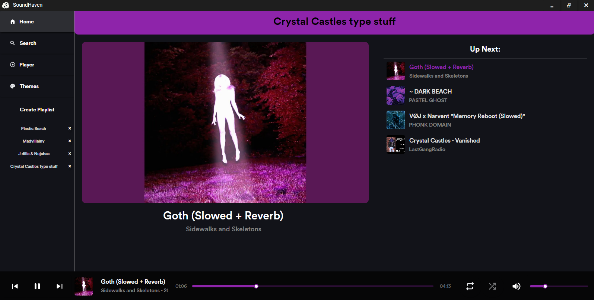

#  SoundHaven


SoundHaven is a powerful, customizable C# music player application built
with Avalonia and the MVVM design pattern. It offers streaming YouTube audio directly from source, 
and downloading said audio in the highest quality for offline use, all in one place. 

##  Features

-  Material UI
-  High-quality audio playback with viewable metadata
-  Last.fm Scrobbling and music recommendation
-  YouTube streaming integration
-  Extract and download YouTube audio
-  Persistent data storage

##  Technologies

SoundHaven leverages a powerful stack of technologies:

- **[Avalonia UI](https://avaloniaui.net/)**: Cross-platform .NET framework for building beautiful, native apps
- **[Material.Avalonia](https://github.com/AvaloniaCommunity/Material.Avalonia)**: Material Design-inspired theme for Avalonia
- **[TagLibSharp](https://github.com/mono/taglib-sharp)**: .NET library for reading and writing audio metadata
- **[MPV](https://mpv.io/)**: Complete, cross-platform solution for playing video and audio including network streams
- **[NAudio](https://github.com/naudio/NAudio)**: .NET audio library with a focus on local audio file manipulation
- **[YoutubeExplode](https://github.com/Tyrrrz/YoutubeExplode)**: Library for downloading YouTube videos and retrieving metadata
- **[SQLite](https://www.sqlite.org/)**: Lightweight, file-based relational database for persistent data storage

##  Getting Started

### Prerequisites

- .NET 6.0 SDK or later
- Last.fm API key

### Installation

1. Clone the repository:
   ```
   git clone https://github.com/XavierRHMN/SoundHaven.git
   ```
2. Navigate to the cloned repository directory:
   ```
   cd SoundHaven
   ```
3. Navigate to the project directory:
   ```
   cd SoundHavenClient
   ```
4. Build the project:
   ```
   dotnet build
   ```
5. Create the ApiKeys directory:
   ```
   mkdir -p ApiKeys
   ```
6. Set up your Last.fm API key:
   ```
   echo "YOUR_LASTFM_API_KEY" > ApiKeys/LASTFM_API.txt
   echo "YOUR_LASTFM_API_SECRET" >> ApiKeys/LASTFM_API.txt
   ```
   Replace `YOUR_LASTFM_API_KEY` and `YOUR_LASTFM_API_SECRET` with your actual Last.fm API key and secret respectively.
7. Run the application:
   ```
   dotnet run
   ```

##  Screenshots

Here are some screenshots of SoundHaven in action:





##  Contributing

Contributions are welcome! Please feel free to submit a Pull Request.

##  License

- This project is licensed under the MIT License - see the [MIT License](LICENSE) file for details.
---

<p align="center">
  Made with ❤️
</p>
