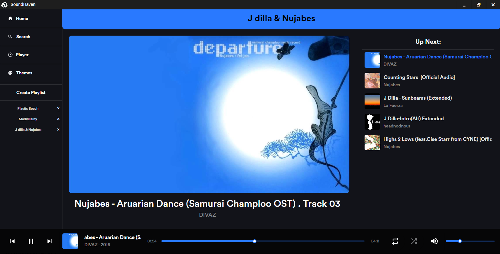
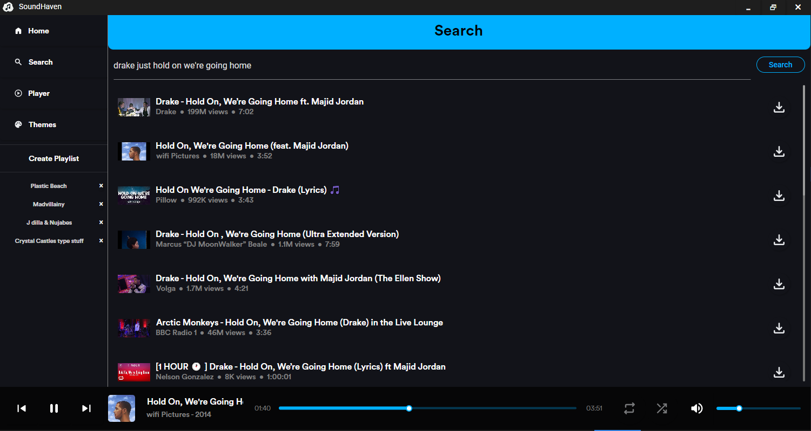
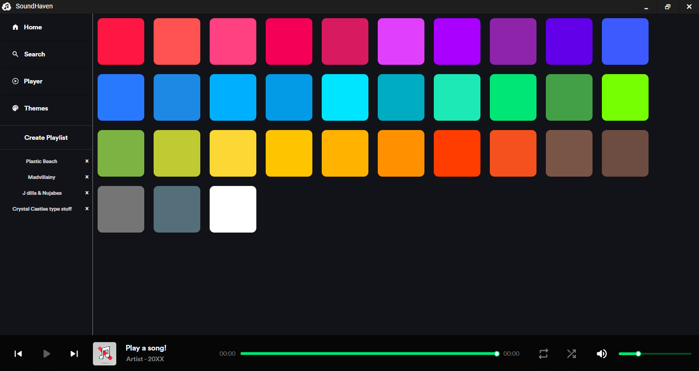

# 🎵 SoundHaven


SoundHaven is a powerful and elegant C# music player application built
with Avalonia and the MVVM design pattern. It seamlessly integrates
various music sources and provides a rich, customizable listening experience.

## ✨ Features

- 🎨 Sleek and modern UI powered by Avalonia
- 🌙 Material design-inspired, backed by Google's Material icon pack
- 🎧 Last.fm integration for scrobbling and music recommendations
- 🎥 YouTube streaming integration utilizing FFmpeg's audio processing
- 🏷️ Advanced audio file tagging and management with TagLibSharp
- 🔊 High-quality audio playback with NAudio
- 📥 Download YouTube videos and extract audio with YoutubeExplode
- 🌈 User-customizable color schemes

## 🛠️ Technologies

SoundHaven leverages a powerful stack of technologies:

- **[Avalonia UI](https://avaloniaui.net/)**: Cross-platform .NET framework for building beautiful, native apps
- **[Material.Avalonia](https://github.com/AvaloniaCommunity/Material.Avalonia)**: Material Design-inspired theme for Avalonia
- **[TagLibSharp](https://github.com/mono/taglib-sharp)**: .NET library for reading and writing audio metadata
- **[FFmpeg](https://ffmpeg.org/)**: Complete, cross-platform solution for audio and video processing
- **[NAudio](https://github.com/naudio/NAudio)**: .NET audio library for playback, recording, and audio file manipulation
- **[YoutubeExplode](https://github.com/Tyrrrz/YoutubeExplode)**: Library for downloading YouTube videos and retrieving metadata

## 🚀 Getting Started

### Prerequisites

- .NET 6.0 SDK or later
- Last.fm API key

### Installation

1. Clone the repository:
   ```
   git clone https://github.com/XavierRHMN/SoundHaven.git
   ```
2. Navigate to the cloned repository directory:
   ```
   cd SoundHaven
   ```
3. Navigate to the project directory:
   ```
   cd SoundHavenClient
   ```
4. Restore the NuGet packages:
   ```
   dotnet restore
   ```
5. Build the project:
   ```
   dotnet build
   ```
6. Create the ApiKeys directory:
   ```
   mkdir -p ApiKeys
   ```
7. Set up your Last.fm API key:
   ```
   echo "YOUR_LASTFM_API_KEY" > ApiKeys/LASTFM_API_KEY.txt
   ```
   Replace `YOUR_LASTFM_API_KEY` with your actual Last.fm API key.
8. Run the application:
   ```
   dotnet run
   ```

## 📸 Screenshots

Here are some screenshots of SoundHaven in action:







## 🤝 Contributing

Contributions are welcome! Please feel free to submit a Pull Request.

## 📄 License

This project is licensed under the MIT License - see the [LICENSE](LICENSE) file for details.

## 🙏 Acknowledgements

- [Last.fm API](https://www.last.fm/api) for music data and scrobbling capabilities
- All the amazing open-source libraries that made this project possible

---

Made with ❤️
